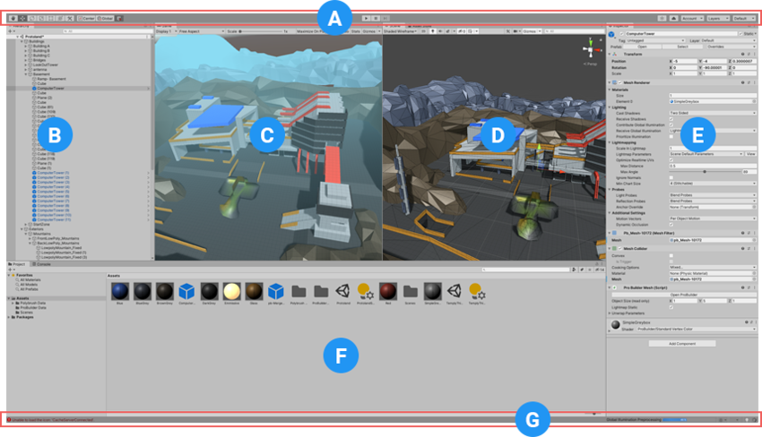
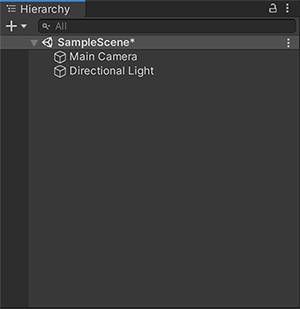
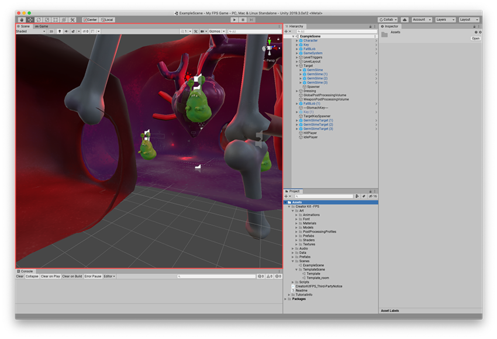
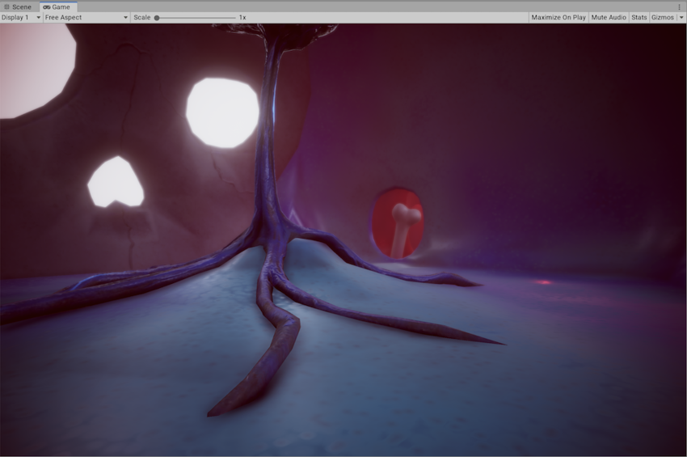
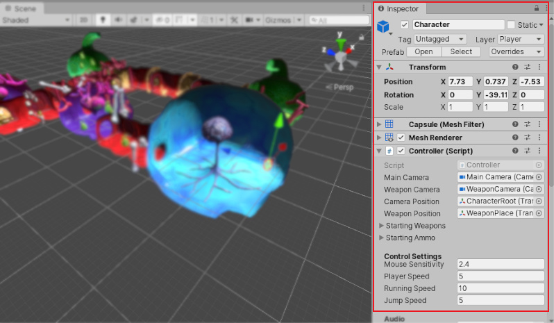
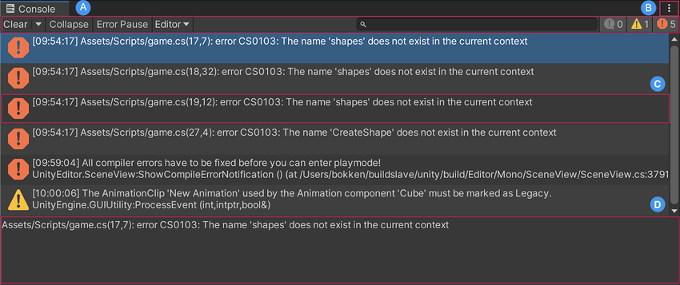
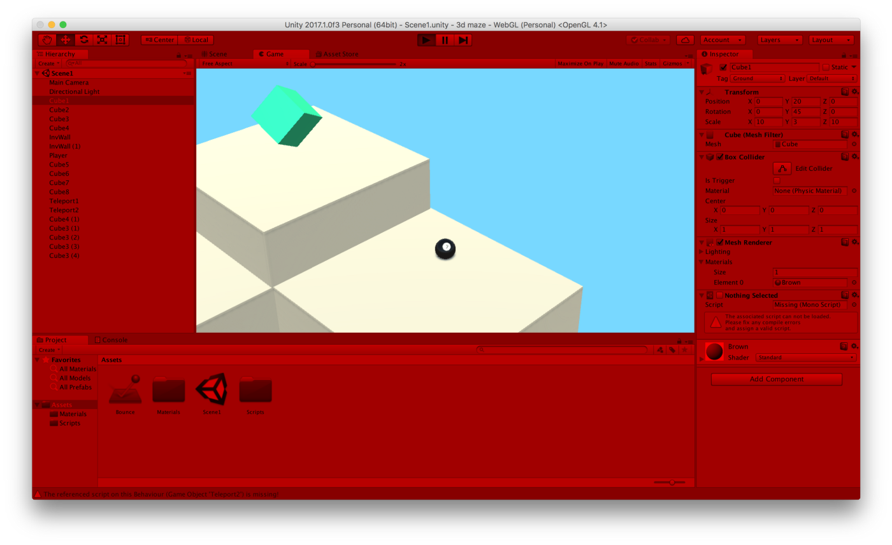
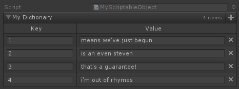

# From Web to Game Developer

**Learn Unity through best practices**

Alternative title: how do I learn Unity by skipping the boring stuff?

Giorgio Pomettini ([@pomettini](https://github.com/pomettini))

---

# Who am I

- Been using Unity since 2013
- Worked on several companies and startups as a Unity dev
- Lead developer on [Fury Roads Survivor](http://www.furyroadssurvivor.com/) (6M+] downloads)
- Programmer on [Blankos Block Party](https://blankos.com/) (shown at E3 2020)
- Now working as a freelancer and teacher

---

# Who is this talk for

- I've opened Unity and I didn't know where to start
- I've followed a tutorial but it didn't help
- I've followed an online course but I'm still confused
- I don't have time, what do I need to do to make a game?

---

# Let's start from scratch

- Unity's interface
- Overview of scripting in C#
- Common mistakes
- Best practices
- Where to look for help
- Where to learn more

---

# Let's start with GameObjects

# 

- Every object in your game is a **GameObject**
- **GameObjects** acts as containers for **Components**
- To give a **GameObject** the properties it needs to become a **Light** or a **Camera**, you need to add components to it
- Unity has lots of different built-in component types, and you can also make your own components, and we'll see how in the next slides

---

# Unity’s interface

# 

---

# A: The Toolbar

# 

- You can find the **Toolbar** at the top of the Unity Editor
- The **Toolbar** consists of several groups of controls, which relate to different parts of the Editor
- In the middle, you can find the **Play**, **Pause**, and Step buttons

---

# B: The Hierarchy window

# 

- The Hierarchy window displays every **GameObject** in a **Scene**
- You can use the Hierarchy window to sort and group the **GameObjects** you use in a **Scene**

---

# C: The Scene view

# 

---

# C: The Scene view

- The **Scene** view is your interactive view into the world you are creating
- **Scenes** are where you work with content in Unity, they are assets that contain all or part of a game or application
- You can use the **Scene** view to select and position scenery, characters, Cameras, lights, and all other types of **GameObjects**
- Selecting, manipulating, and modifying **GameObjects** in the **Scene** view are some of the first skills you must learn to begin working in Unity

---

# D: The Game view

# 

---

# D: The Game view

- The Game view is rendered from the **Camera(s)** in your application
- You need to use one or more **Cameras** to control what the player sees when they are using your application
- The default scene does provide a **Camera** and a **Directional Light**

---

# E: The Inspector window

# 

---

# E: The Inspector window

- Use the **Inspector** window to view and edit properties and settings for almost everything in the Unity Editor, including **GameObjects**, Unity components, Assets, Materials, and in-editor settings and preferences
- What you can see and edit in an **Inspector** window depends on what you select
- This section describes what an **Inspector** window displays for different types of items you can select.

---

# E: The Inspector window

# 

---

# F: The Project window

# 

- The Project window displays all of the files related to your Project and is the main way you can navigate and find Assets and other Project files in your application

---

# Console Window

# 

- The Console Window displays errors, warnings, and other messages the Editor generates
- These errors and warnings help you find issues in your project, such as script compilation errors
- To open the Console, from Unity’s main menu go to **Window > General > Console**

---

# Let's create our first GameObject

- To create a new **GameObject** in the **Hierarchy** window:
  - Right-click on empty space
  - Select **Create Empty**
  - Give the **GameObject** the name you want (I called mine Car)

# 

---

# Let's assign a component to our GameObject

- To assign a component to our **GameObject**, click **Add Component** on the **Inspector** and select the component that you want to assign
- For example, a Light object is created by attaching a **Light** component

# 

---

# Scripting

- Unity supports the C# programming language
- C# is a garbage collected, strongly typed, object-oriented language
- It's somewhat similar to Java or C++ (minus the memory managment)
- Let's create our first script by going to **Assets > Create > C# Script**

# 

- The name of the file (and the Class) will be the name of your Component

---

# Scripting

- The new script will be created in whichever folder you have selected in the **Project** panel
- When you double-click a script Asset in Unity, it will be opened in a text editor
- By default, Unity will use Visual Studio, but you can select any editor you like from the **External Tools** panel in Unity’s preferences (go to **Unity > Preferences**)

---

# Anatomy of a Script file

```csharp
using UnityEngine;
using System.Collections;

public class MyScript : MonoBehaviour
{
    // Use this for initialization
    void Start()
    {

    }

    // Update is called once per frame
    void Update()
    {

    }
}
```

---

# Wait, what is a MonoBehaviour?

- **MonoBehaviour** is the base class from which every Unity script derives
- When you create a C# script from Unity’s project window, it automatically inherits from **MonoBehaviour**, and provides you with a template script
- Initialization of an object is not done using a constructor function
- The construction of objects is handled by the editor
- Classes that inherits from **MonoBehaviours** has some methods (eg. **Start**, **Update**) that will be called by the editor automatically via reflection

---

# Variables and the Inspector

- When creating a script, you are essentially creating your own new type of component that can be attached to **GameObjects** just like any other component
- Just like other Components often have properties that are editable in the inspector, you can allow values in your script to be edited from the **Inspector** too
- In C#, the simplest way to see a variable in the **Inspector** is to declare it as public
- You can use the `SerializeField` attribute to serialize (which is another way to say that Unity is storing that value) a private variable and show it in the **Inspector**

---

# Variables and the Inspector

```csharp
using UnityEngine;
using System.Collections;

public class MyScript : MonoBehaviour
{
    public string myName;

    // Use this for initialization
    void Start()
    {
        Debug.Log("Hello my name is " + myName);
    }
}
```

This code creates an editable field in the **Inspector** labelled “My Name”

---

# Variables and the Inspector

You can attach a script by dragging the script asset to a **GameObject** in the **Hierarchy** panel or to the **Inspector** of the **GameObject** that is currently selected

# 

- If you edit the name and then press **Play**, you will see that the message includes the text you entered.

# 

---

# Common mistakes

---

# Common mistake #1: Forget Inheritance

- Always prefer composition over inheritance
- Example: you're making a game that has a lot of swords, it would be reasonable to make a **WeaponBase** class that other weapons can inherit from
- The **WeaponBase** can contain a generic method like **DoDamage** that can be overridden by sub-classes

```csharp
public class WeaponBase : MonoBehaviour
{
    public virtual void DoDamage()
    {
        // Do damage
    }
}
```

---

- Depending of what your weapons should do (eg. fire damage, poison damage) at some point you will have lot of duplicate code for each weapon
- Why not making a **FireDamage** or a **PoisonDamage** component and reference it to your weapon instead?

```csharp
public class FireWeapon : MonoBehaviour
{
    public FireDamage DamageComponent;

    public void DoDamage()
    {
        DamageComponent.Calculate();
    }
}
```

- You can use a Strategy-pattern like way to abstract behaviours by using **Interfaces** or **ScriptableObjects** (I'll talk about that in the next slides)

---

# Common mistake #2: Forget Design Patterns

- Unity works with **Monobehaviours**, but classes that derives from **MonoBehaviours** cannot be instantiated via code (the editor is doing that internally)
- Most of the design patterns require to instantiate classes, so what do we do?
- You can still use design patterns but in a Unity way
- Here you can find some examples: [https://github.com/Habrador/Unity-Programming-Patterns](https://github.com/Habrador/Unity-Programming-Patterns)
- Yes, you can use Singletons with **MonoBehaviours**, but don't abuse them! :)

---

# Common mistake #3: Use strings carefully

- Strings are being allocated on the heap and Unity is using garbage collection
- That is not a problem if you're using them once, but if you need to update them frequently (eg. to display the health of your Player) on slow devices you may have performance issues
- You can use **StringBuilder** to make a mutable string that allocates just once

```csharp
using System;
using System.Text;

StringBuilder myStringBuilder = new StringBuilder("Hello World!");
```

- Also, don't use them for comparison (prefer enums instead)

---

# Common mistake #4: Don't use Invoke

- If you look at older Unity tutorials or forums posts, people will say that the **Invoke** method can be used to make timed events (eg. spawn an enemy every 5 seconds)

```csharp
void Start()
{
    Invoke("SpawnEnemy", 5.0f);
}

void SpawnEnemy()
{
    // Spawn your enemy
}
```

- For performance and maintenability reasons, it's better to use **Coroutines**
- We'll learn about **Coroutines** in the next slides

---

# Common mistake #5: Play mode doesn't save?

- In **Play mode**, any changes you make are temporary, and are reset when you exit **Play mode**
- The Editor UI darkens to remind you of this
- You can change the **Play mode** tint to a different color to avoid confusion by going to **Unity > Preferences** (On Mac) or **Edit > Preferences** (On Windows)

# 

---

# Common mistake #5: Play mode doesn't save?

# 

---

# Best practice #1: Cache stuff on Start

- Avoid putting expensive operations in the **Update** method, as they will be executed every frame (~16ms) and in the long run they may cause performance issues
- For instance, in Unity if you want to get a reference another component in your **GameObject**, you can use the method `GetComponent<MyComponentType>`

```csharp
void Update()
{
    GetComponent<PlayerHealth>().Health += 0.1f;
}
```

- It is advised to store that reference in a local variable instead of calling `GetComponent` every frame, for performance and maintenability reasons

---

# Best practice #1: Cache stuff on Start

```csharp
public class Player : MonoBehaviour
{
    public PlayerHealth Health;

    void Start()
    {
        Health = GetComponent<PlayerHealth>();
    }

    void Update()
    {
        GetComponent<PlayerHealth>().Health += 0.1f;
    }
}
```

---

# Best practice #2: Learn about Interfaces

- **Interfaces** contains definitions of methods or variables that the class which uses it must implement, basically ensuring that any class that uses a certain interface has all its methods implemented
- **Interfaces** have no implementation. They are a contract/template that an implementing class must match

```csharp
public Interface IPickable
{
    void Pick()
}
```

---

# Best practice #2: Learn about Interfaces

- Although an object can only inherit from one class, it can implement infinite number of **Interfaces**
- To implement an **Interface** in a C# script, add interface name after the **MonoBehaviour**

```csharp
public class Book : MonoBehaviour, IPickable

{
    public void Pick()
    {
        // Do something when object is picked
    }
}
```

---

# Best practice #2: Learn about Interfaces

- In Unity it is possible to get interface references calling **GetComponent<T>()**
- For the example above you would call `GetComponents<IPickable>()` and that will return all references to implementations of the interface on your **GameObject**
- You can use the same technique to check if a **GameObject** has a script that matches that interface (eg. the player can only pick objects that has the **IPickable** interface)

---

# Best practice #3: Learn about Coroutines

- A **Coroutine** is a special type of function used in Unity to stop the execution sometime or certain condition is met, and continue from where it had left off
- **Coroutines** can be used for two reasons: asynchronous code and code that needs to compute over several frames
- You may think that **Coroutines** are similar to **Async/Await**, but they are not because they're running on the same thread
- There is **Async/Await** on C#, but most of the Unity APIs will use **Coroutines**, so you better learn how to use them
- I'll show you an example on how to make a Get request with **Coroutines**

---

# Best practice #3: Learn about Coroutines

```csharp
public class ExampleGetRequest : MonoBehaviour
{
    void Start()
    {
        StartCoroutine(GetText());
    }

    IEnumerator GetText()
    {
        UnityWebRequest www = UnityWebRequest.Get("http://www.my-server.com");
        yield return www.Send();

        if(!www.isError)
        {
            Debug.Log(www.downloadHandler.text);
        }
    }
}
```

---

# Best practice #4: ScriptableObjects

- **ScriptableObjects** are data containers that can be saved as assets in the projec
- They cannot be attached to a **GameObject** in a **Scene** (but you can reference them in your **Scripts**)
- Most often, they are used as assets which are only meant to store data, but you can use them as a way to pass data between **Scripts**
- If you want to know how, watch the [Game Architecture with Scriptable Objects](https://www.youtube.com/watch?v=raQ3iHhE_Kk) talk by Ryan Hipple

---

# Best practice #5: Custom editors with Odin

- You use [**Odin Inspector**](https://odininspector.com/) to rapidly create custom Editor Windows to help organize your project and game data
- You can also use Odin to serialize (show in inspector) values that would not be serialized by Unity, such as **Properties** or **Dictionaries** (HashMaps)

# 

---

# Useful resources

- [Brackeys Youtube Channel](https://www.youtube.com/channel/UCYbK_tjZ2OrIZFBvU6CCMiA)
- [Jason Weimann's Youtube Channel](https://www.youtube.com/channel/UCX_b3NNQN5bzExm-22-NVVg)
- [Catlike Coding's Tutorials](https://catlikecoding.com/unity/tutorials/)
- [Alan Zucconi's Tutorials](https://www.alanzucconi.com/tutorials/)
- Most of the time a Google search will give you the answer (duh!)

---

# Thank you

- Questions?
