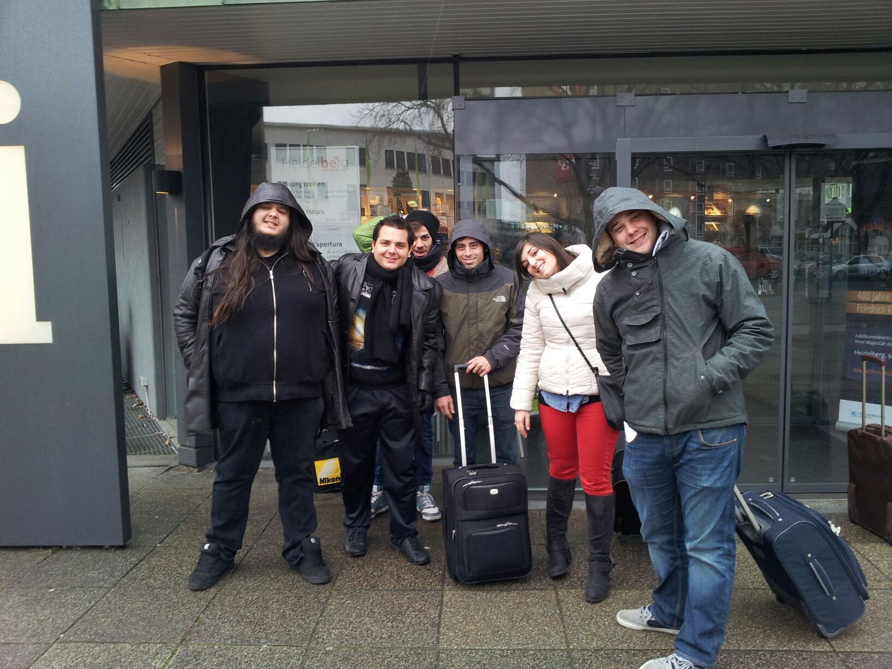
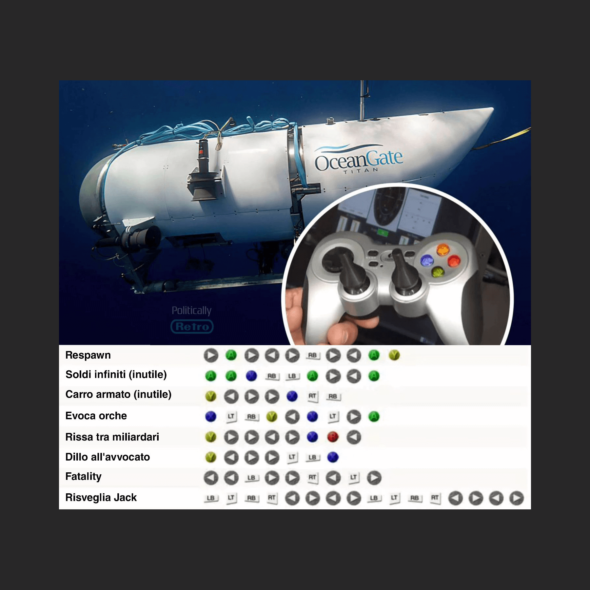
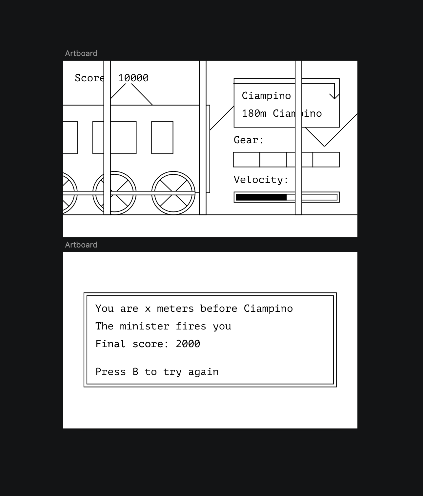
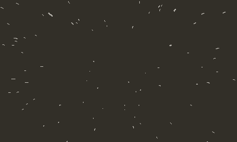
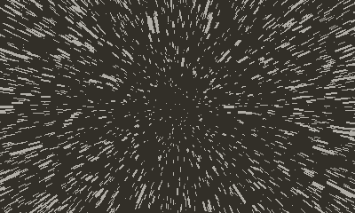

# Train to Ciampino Postmortem

Giorgio Pomettini ([@pomettini](https://github.com/pomettini))

---

# Team

- Failed artist turned programmer
- Went to my first **GGJ** in 2013 and won a prize\* by **Filas**, now **[Lazio Innova](https://www.lazioinnova.it/)**
- Went to more than 30 game jams between **Rome**, **Sweden**[\*](https://www.nomoresweden.com/)[\*](https://www.facebook.com/castlegamejam/) and **Slovenia**[\*](https://creative-goods.si/en/multimedia-production/outfit7-talent-camp-2019/)
- Going to my first **GGJ** kickstarted my carrer in game development

---

# \*Wtf, did they have prizes? <!-- fit -->

- Well, sorta
- We were invited to pitch our game in an event in **Heidelberg** 🇩🇪 _(**Filas** kindly paid all the travel expenses)_
- Got to pitch the game in English _(and it was embarrassing)_
- But I met the founders of [Gamepix](https://www.gamepix.com/) who later offered me **my first ever game development job**

---

## But i thought it was a talk about the game...

_(Yeah, you're right, sorry)_

---

# Idea

- I had **ZERO** ideas during the weekdays of the **GGJ**
- Thought of making a game about the **OceanGate/Titan**
- Scrapped the idea because I thought the game mechanic wasn't fun
- I only had a self-imposed limitation: **using the [Playdate's](https://play.date/) crank as the only input for the game**

---

# Execution

- I wanted to make the game by **only using graphical primitives drawn by code**
- So I first designed all the graphics and UI on [Sketch](https://www.sketch.com/), then I implemented all the game mechanics
- Thought of adding gears like the [CSR game](https://www.csr-racing.com/), but I wanted to **make the game simple** _(and I desperately wanted to sleep)_

---

# What went right

- I got to finish the game _(yay!)_
- The scope was tiny so I had found time to sleep
- Shared the table with my bros who were fun and supportive ❤️

---

# What went wrong

- Couldn't try all the games _(sorry!)_
- Didn't find time to add sounds or music
- No coffee at the venue 😭

---

# The end

---

## _Wait, I have more things to say_

---

# What is that weird yellow _Gameboy_?

- 400 × 240 1-bit display
- 168 MHz Cortex M7 CPU
- 16 MB RAM
- 4 GB Flash
- Comparable to a DSi but without hardware acceleration
- $199 + shipping + taxes _(~€266)_ but it comes with 24 free games
- Every device [is a devkit](https://play.date/dev/)

---

# Making a game for the Playdate

- You can use **Lua** or **C** to make games for the [Playdate](https://play.date/)
- Instead, I wanted to use **Rust**
- But the [toolchain](https://github.com/pd-rs/crankstart) had some limits _([graphical patterns are not supported](https://github.com/pd-rs/crankstart/issues/63), for instance)_
- Since the **Playdate** needs a binary to be compiled for **ARM7**, I can't use Rust's standard library and most of the crates available
- Also **no heap allocations**\* because in embedded, memory fragmentation is a serious threat if you don't have an OS to manage it
- \*Luckily the [alloc crate](https://crates.io/keywords/alloc) will point all the dynamic structures to **Playdate**'s custom heap allocator _(otherwise the game would have no text lol)_

---

# Rust vs C benchmark

- [Wrote a port](https://github.com/Pomettini/starfield-playdate-rs) of a [Starfield sketch](https://thecodingtrain.com/challenges/1-starfield) _(not [the game](https://bethesda.net/it/game/starfield))_ for fun
- In **Rust** I was able to draw **600 rays at 50 fps**
- Drawing more than 600 rays would throw a **stack overflow** 🤔

---

# Rust vs C benchmark

- By [writing the same script in **C**](https://github.com/Pomettini/starfield-playdate-c) I was able to achieve **10000 rays at 25 fps**
- But then I discovered that the [**Playdate** has a stack size of 61.8kb](https://devforum.play.date/t/debugging-c-crashes-on-device-understanding-hardware-limits/6129)
- The **Rust** port using the heap was able to achieve the same performance 🔥

---

# Not only Rust

If you're crazy enough you could write your **Playdate** game in:

- [Swift](https://devforum.play.date/t/using-the-swift-programming-language-on-playdate/4182)
- [Zig](https://github.com/DanB91/Zig-Playdate-Template)
- [Nim](https://devforum.play.date/t/playdate-nim-bindings-c-performance-python-like-syntax/)
- [Assembly](https://sgeos.github.io/gamedev/playdate/asm/arm/x86/2022/10/05/asm_playdate_development.html)
- [Fortran](https://sgeos.github.io/gamedev/playdate/fortran/2022/10/10/fortran_playdate_development.html) 😱

But none of them has full API coverage so I would stick with **Lua** or **C** instead

---

# The end

For real this time

