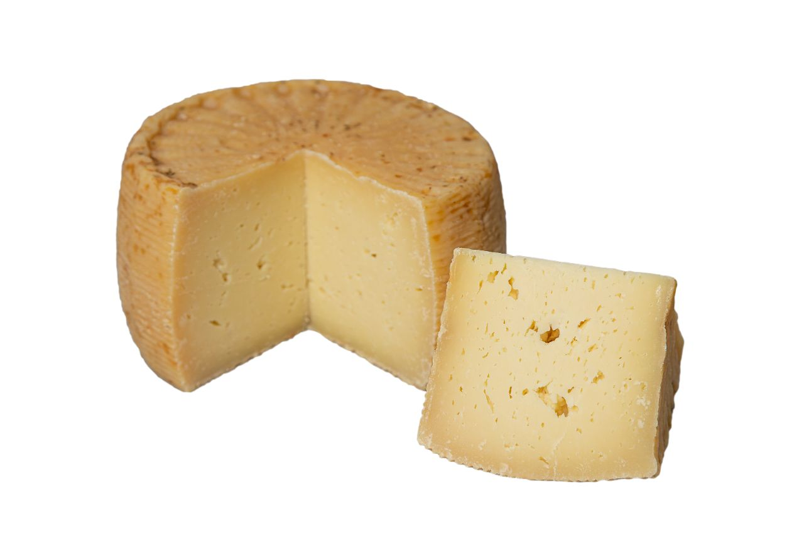
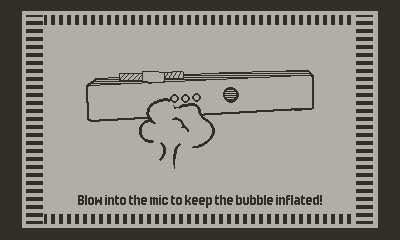

# Bobble is You Postmortem

Giorgio Pomettini ([@pomettini](https://github.com/pomettini))

---

# But you were not at the jam!

Yeah you're right

---

# The end

---

## _Lol just kidding_

---

# The game™

- **Platform:** Playdate
- **Genre:** Puzzle? Action?
- **Colors:** Two
- **Ram usage:** Less than 10Kb
- **Woke?** Let me sleep

---

---

# So, what is the game about?

It's complicated, let me explain...

---

---

---

---

---

---

---

---

# Why are you mad?

- We had so many ideas
- But then at some point I said:
- _"What if we made all of them at the same time?"_ 😈

---

# Ingredients

- Made with [Playdate SDK 2.6.2](https://play.date/dev/)
- [Lua Playdate template](https://github.com/SquidGodDev/playdate-template) for [VSCode](https://code.visualstudio.com/)
- Pixel art made in [Aseprite](https://www.aseprite.org/) and assembled in [Figma](https://www.figma.com/)
- Music made in [FamiTracker](http://famitracker.com/)
- A single file of **605 lines of procedural Lua code** _(don't do that, kids)_ 🔥

---

# What went right

- The game was ready one hour before the deadline _(yay!)_
- Super happy about the end result
- I <3 to make **Playdate** games
  - Build times are 1000x times faster than Unity
  - Technical limitations = _(almost)_ no overscoping
- It's good to work in a team again ❤️

---

# What went wrong

- Technical shit
  - Doesn't run well in the simulator
  - Some bugs in sprite drawing routines (color inversion is borked for some reason?)
- Should have invested more time in making the tutorial
- Wish I had sleep a little bit more 💀

---

# Team

- Pomettini _(he/him)_
- Amaryllis _(they/them)_
- Lupetti _(they/them)_

---

# The end

This time, for real

