# Let's make a game for the Playdate

**Also called "the Game Boy redesigned for the age of Netflix"**

Giorgio Pomettini ([@pomettini](https://github.com/pomettini))


---

# What's in this talk

- Setting up a dev environment
- Lua language overview
- Making a player moving on the screen
- How to use the Crank (duh)
- Where to look for help
- Profit _(yes really!)_

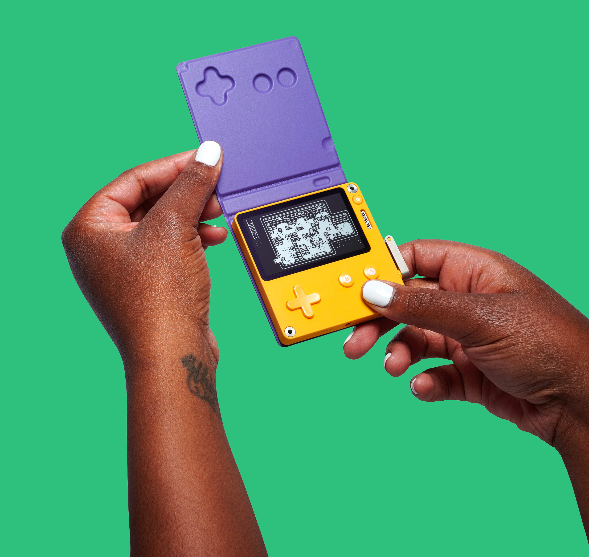

---

# Brief history

- Created by [Panic](https://panic.com/), a notable Mac software house, as a way to celebrate their 20th birthday
- Announced on May 2019
- Started shipping on April 2022
- $179 (w/ taxes & shipping: €280)
- Comes with [24 exclusive games](https://play.date/games/) for free (season one)

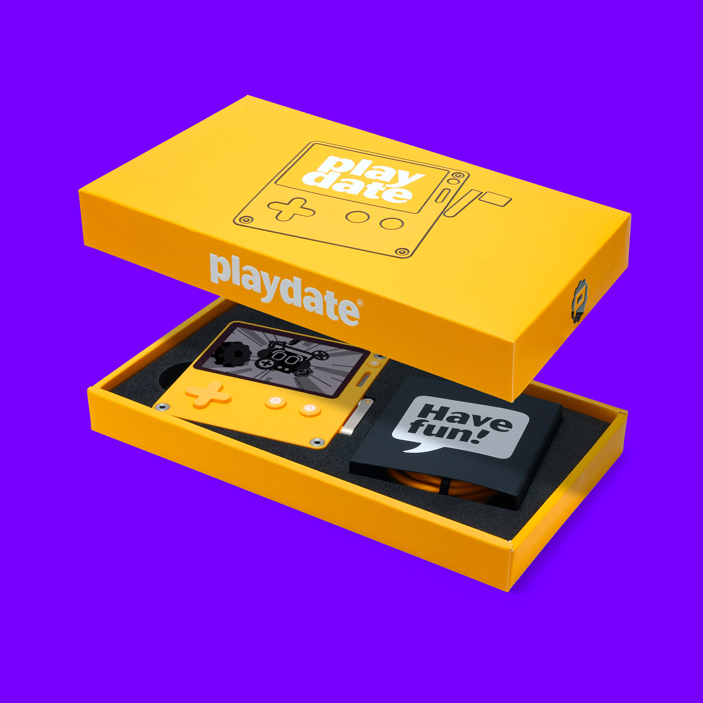

---

# Tech specs

**Display**

- Monochrome 1-bit memory LCD display, 400x240px resolution *(similar to an e-ink)*
- Refreshed at 30 fps by default, maximum 50 fps

**Controls**

- Eight-way d-pad, two primary buttons
- Collapsible crank, accelerometer

**Sound:** Internal speaker, microphone, headphone jack
**Connectivity:** Wi-Fi, Bluetooth
**Memory & Storage:** 16MB _(yes, megabytes!)_ RAM, 4GB flash storage

---

# Dev environments

- [Pulp](https://play.date/pulp/) on your browser
- [Playdate SDK](https://play.date/dev/) which supports Lua or C
- [Visual Studio Code](https://code.visualstudio.com/) on Windows, Mac and Linux
- [Nova](https://nova.app/) on Mac (recommended but $$$)
- Playdate Simulator (included in the SDK)
- A Playdate _(if you have one)_

---

# Pulp

- [Pulp](https://play.date/pulp) is an online game maker for Playdate (inspired by [Bitsy](https://bitsy.org/))
- It’s an all-in-one game studio: it includes sprite, animation, music and a level editor
- Uses [PulpScript](https://play.date/pulp/docs/pulpscript/), which is a friendly scripting language
- However, since Pulp games are limited in scope, we'll use the [Playdate SDK](https://play.date/dev/) instead

---

# 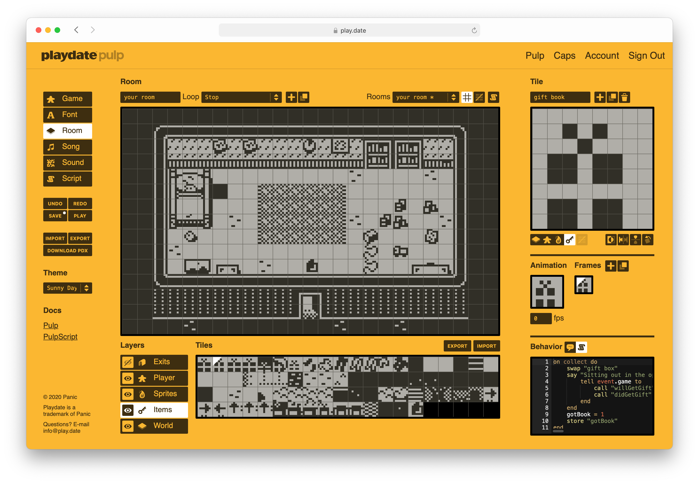

---

# Playdate Simulator

- Download the [Playdate SDK](https://play.date/dev/)
- Launch the Playdate Simulator

# 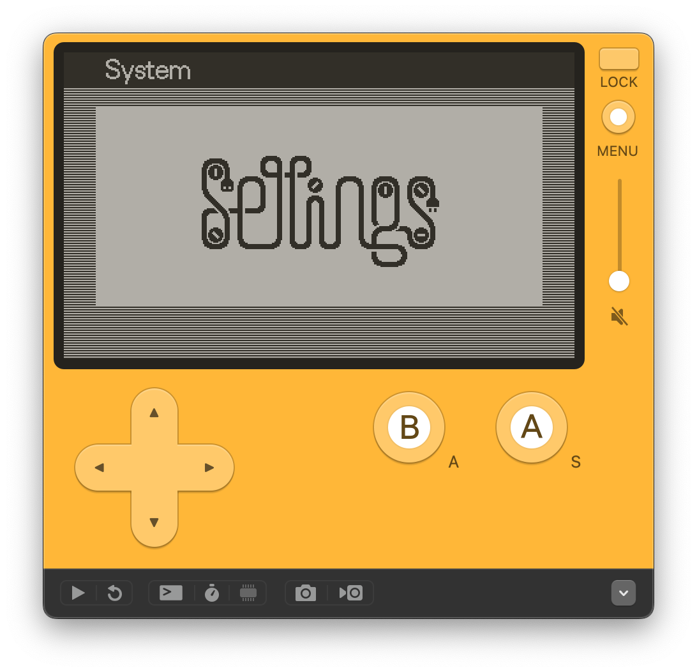

---

# Visual Studio Code setup

- Make sure you have Visual Studio Code installed
- Download the [Playdate extension](https://marketplace.visualstudio.com/items?itemName=Orta.playdate)
- Fork the Visual Studio Code template for [Windows](https://github.com/Whitebrim/VSCode-PlaydateTemplate) or for [MacOS](https://github.com/cadin/playdate-vscode-template)
- Specify our project’s _Source_ folder. It will use _./Source_ or _./source_ by default
- Ctrl/Cmd + Shift + P → **Run app in Playdate Simulator**

---

# Nova setup

- Make sure you have Nova installed
- Install the [Playdate extension](https://extensions.panic.com/extensions/com.panic/com.panic.Playdate/)
- Click on the project name in the top left of the window toolbar
- In the **Build & Run section** of the resulting dialog, click the **plus** button
- Choose **Playdate Simulator** from the list of options to create a new configuration
- Specify our project’s _Source_ folder. It will use _./Source_ or _./source_ by default
- Press the **Run** button in the upper left corner of the window to invoke the Playdate Simulator and run your game

---

# 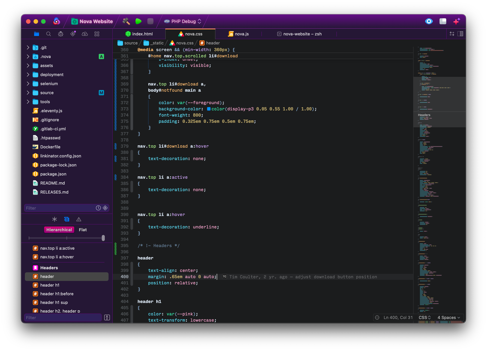

---

# Hello world!

```lua
-- main.lua

print("Hello world!")
```

# 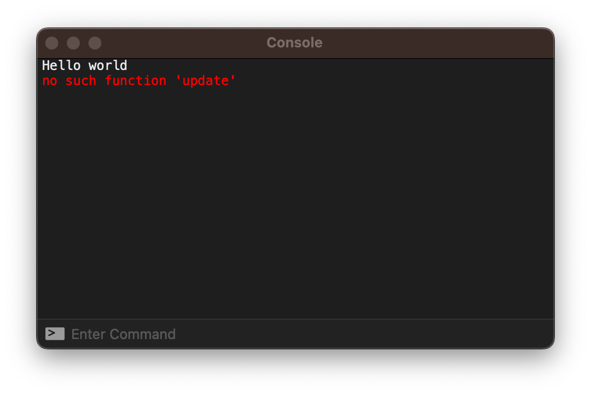

---

# Brief intro to Lua

- Lua is a dynamically typed language
- There are no type definitions in the language, each value carries its own type

#### Primitives

```lua
"Hello world"   -- string
10.4            -- number
true            -- boolean
nil             -- nil
print           -- function
```

---

# Functions

- Functions can both carry out a specific task or compute and return values

```lua
function add(a, b)
    return a + b
end

print(add(10, 20))  -- Returns 30
```

- In that syntax, a function definition has a name *(add)*, a list of parameters *(a and b)*, and a body, which is a list of statements

---

# Tables

- The table type are associative arrays
- Associative arrays are similar to **PHP** arrays or **Javascript** objects, they are key/value containers that can also be used as lists
- Tables have no fixed size, you can add as many elements as you want to a table dynamically

```lua
-- Create a table and store its reference in `player'
player = {}
player["hp"] = 100
print(player["hp"])     -- Prints 100
print(player.hp)        -- Prints 100 (Same as above)
```

---

# Tables

- Each table may store values with different types of indices and it grows as it needs to accommodate new entries

```lua
a = {}
a[10] = "Hello"
a["x"] = "World"
print(a[10])        -- Prints "Hello"
print(a.x)          -- Prints "World"
print(a[20])        -- Prints nil (undefined)
```

- Table fields evaluate to nil if they are not initialized

---

# Loops

```lua
-- A numeric for has the following syntax

for i = 1, 5 do
    print(i)
end

-- Output:

-- 1
-- 2
-- 3
-- 4
-- 5
```

**Watch out:** In Lua, indices starts at 1 _(ugh!)_

---

# Loops

- The basic Lua library provides **pairs**, a handy function that allows you to iterate over the elements of a table

```lua
a = {}
a[10] = "Hello"
a["x"] = "World"

for key, value in pairs(a) do
    print(key .. " - " .. value)  -- Concat strings with ..
end

-- Output:

-- 10 - Hello
-- x - World
```

---

# Conditionals

```lua
-- If statements are not so different from other languages

if a < 0 then a = 0 end

-- If else statement

if a < b then
    return a
else
    return b
end

-- But I personally prefer the inlined style

if a < b then return a else return b end
```

---

# Scoping

In Lua, every variable is global by default (use local to avoid conflicts, overriding and _bugs_)

```lua
a = 0           -- Global scope
local b = 0     -- Local scope

do              -- New scope (can be a function, a loop, etc)
    a = 5
    b = 5
    local c = 5
end

print(a)        -- Prints 5
print(b)        -- Prints 0
print(c)        -- Prints nil
```

---

# Loading a Sprite

```lua
-- Importing Playdate core libs

import "CoreLibs/graphics"
import "CoreLibs/sprites"

gfx = playdate.graphics                     -- Shortcut to gfx library

player = gfx.sprite:new()                   -- Creates a new sprite object
player:setImage(gfx.image.new('player'))    -- 'player.png' is being loaded
player:moveTo(200, 120)                     -- Moving the sprite in the center
player:addSprite()                          -- Adds the sprite to the display list

function playdate.update()
    gfx.sprite.update()                     -- Calls update() on every sprite
end
```

---

# 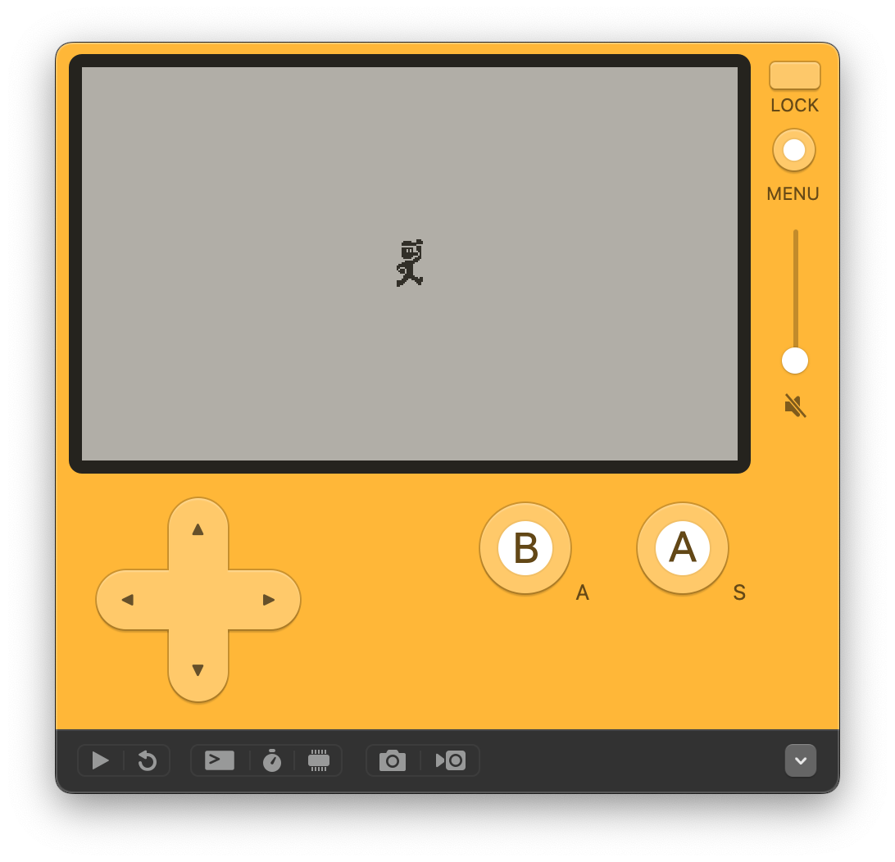

---

```lua
-- Make the player sprite five time bigger

player:setScale(5)
```

# 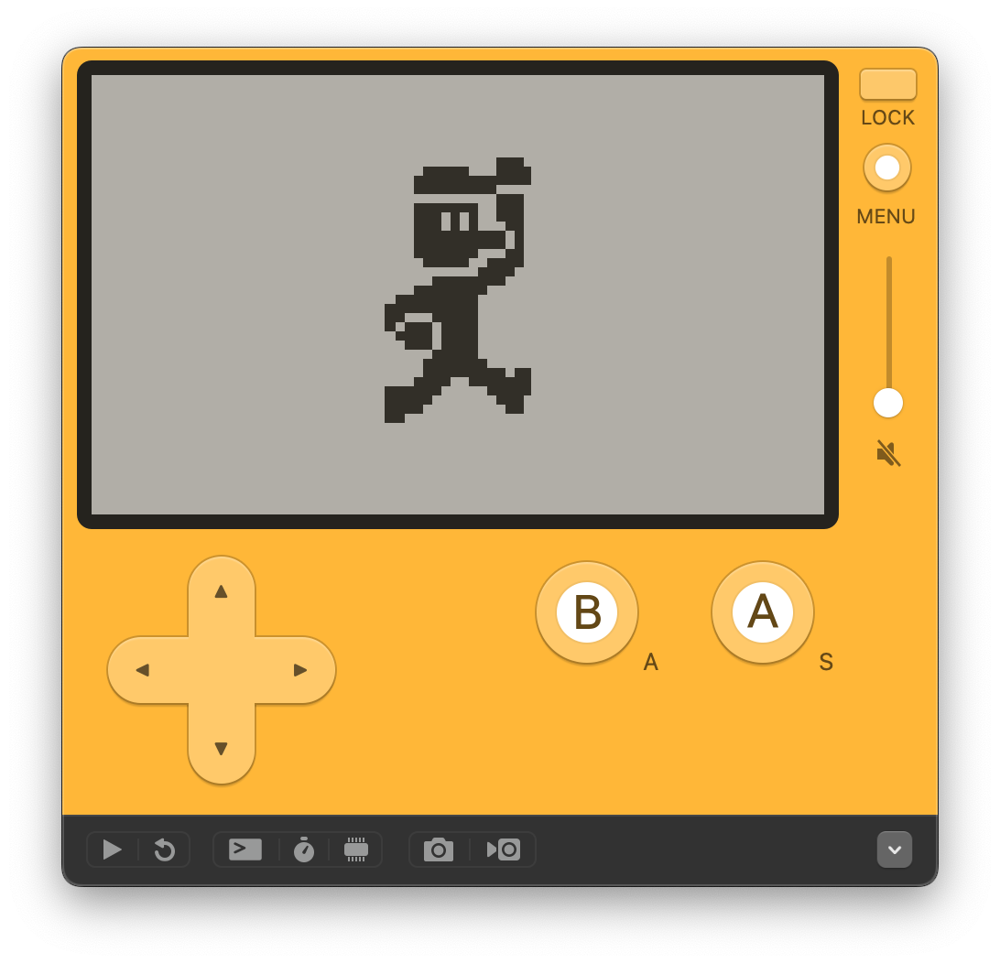

---

```lua
-- Rotating a sprite (in degrees)

player:setRotation(135)
```

# 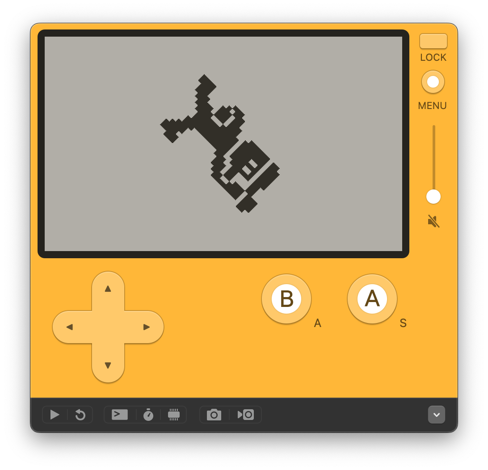

---

```lua
-- Flipping a sprite (on the horizontal side)

player:setImageFlip(gfx.kImageFlippedX)
```

# 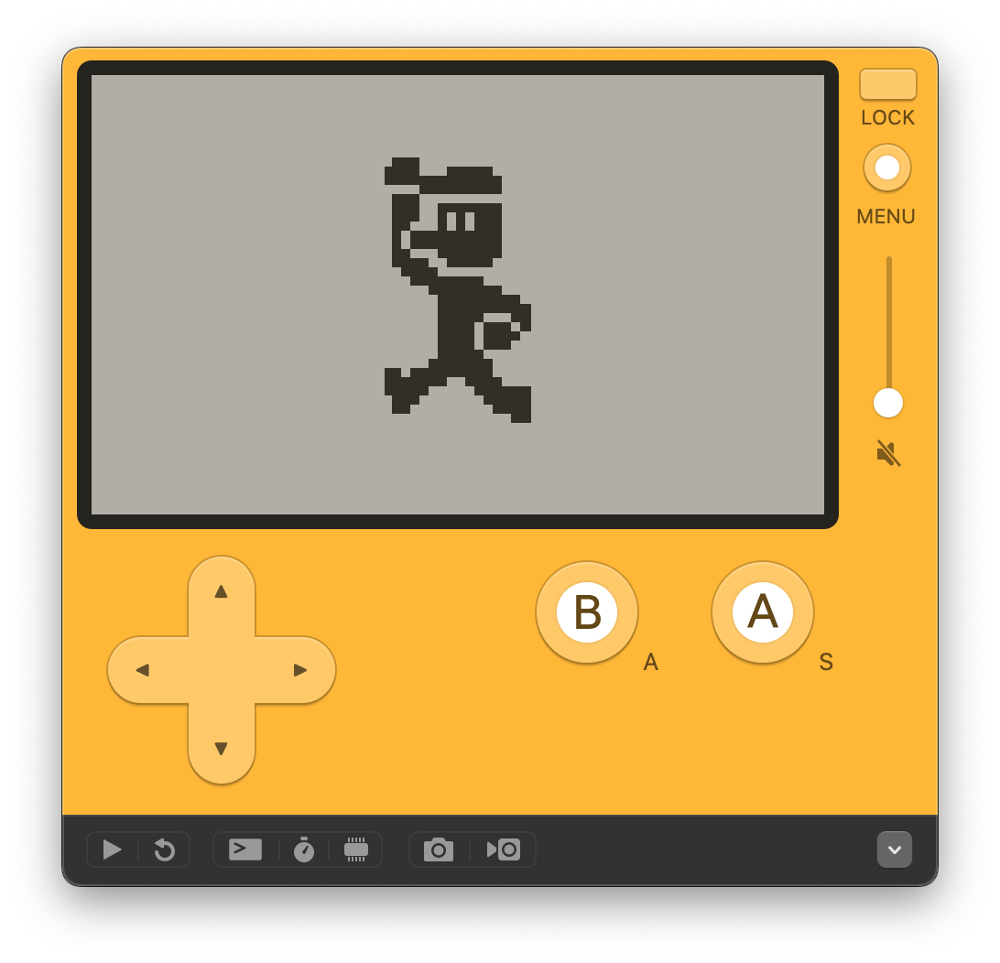

---

# Transforming a Sprite

```lua
-- Setting the z-index for the sprite (high value = draw first)

player:setZIndex(10)

-- Sprites that aren’t visible don’t get their draw() method called

player:setVisible(false)
```

For more sprite-related methods have a look at their [Inside Playdate](https://sdk.play.date/Inside%20Playdate.html#_sprite_basics) section

---

# Moving a sprite

```lua
function playdate.leftButtonDown()
    player:moveTo(player.x - 10, player.y)  -- Player is moving to the left
end

function playdate.rightButtonDown()
    player:moveTo(player.x + 10, player.y)  -- Player is moving to the right
end

function playdate.upButtonDown()
    player:moveTo(player.x, player.y - 10)  -- Player is moving up
end

function playdate.downButtonDown()
    player:moveTo(player.x, player.y + 10)  -- Player is moving down
end
```

---

# Using the Crank

- For **playdate.cranked()**, **change** is the angle change in degrees
- **acceleratedChange** is change multiplied by a value that increases as the crank moves faster, similar to the way mouse acceleration works

```lua
-- Moves player horizontally based on how you turn the crank

function playdate.cranked(change, acceleratedChange)
    player:moveTo(player.x + change, player.y)
end
```

---

# 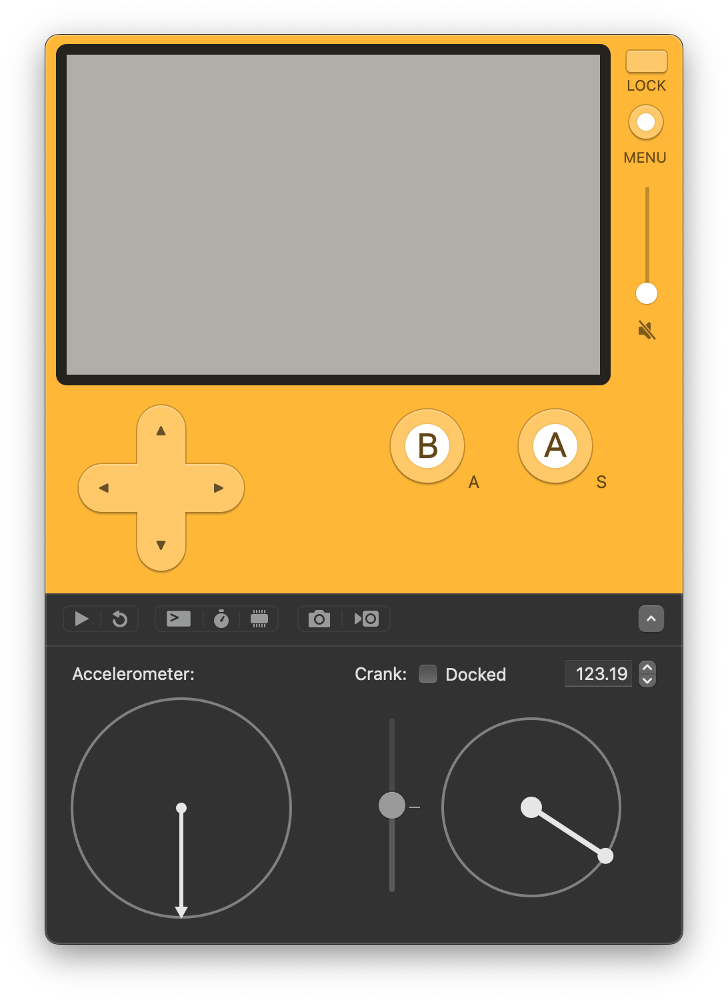

---

# OOP

- Lua does not offer built-in support for object-oriented programming of any kind
- CoreLibs provides a basic object-oriented class system
- **Object** is the base class all new subclasses inherit from

```lua
-- Base class is Animal

class('Animal').extends()

-- Cat is a subclass of Animal

class('Cat').extends(Animal)
```

---

# OOP

- Classes are provided with an **init** function
- The subclass decides how many and what type of arguments its **init** function takes

```lua
function Cat:init(age, weight)
    Cat.super.init(self, age)
    self.weight = weight
end
```

- The **init** function will call its superclass’s implementation of **init**

---

# OOP

Let's make an example by putting the player logic in its class

```lua
-- player.lua

import "CoreLibs/graphics"
import "CoreLibs/sprites"

gfx = playdate.graphics

class("Player").extends(gfx.sprite)

function Player:init(x, y)
    Player.super.init(self)
    self:setImage(gfx.image.new('player'))
    self:moveTo(x, y)
    self:addSprite()
end
```

---

# OOP

Looks better now, don't you think?

```lua
import "CoreLibs/graphics"
import "CoreLibs/sprites"
import "player"             -- We need to import the player file

gfx = playdate.graphics

player = Player(200, 120)

function playdate.update()
    gfx.sprite.update()
end
```

---

```lua
players = { Player(100, 120), Player(200, 120), Player(300, 120) }
```

# 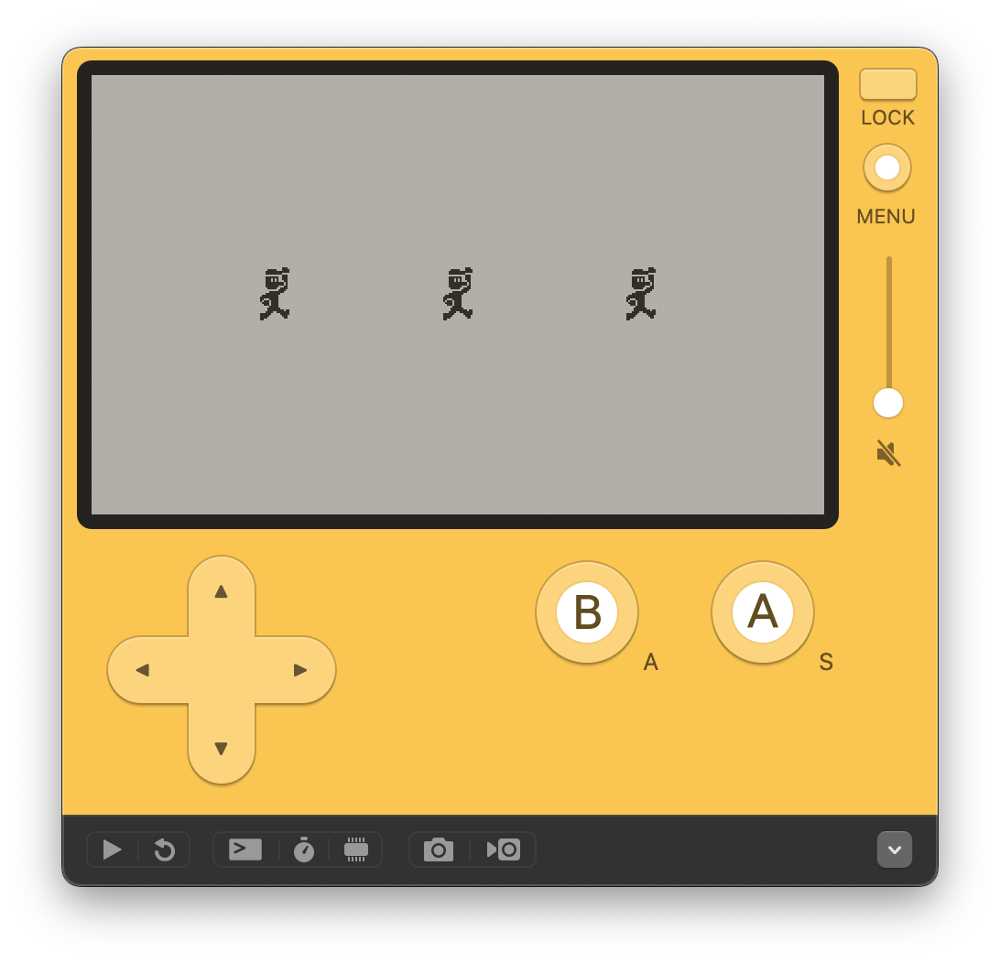

---

# Documentation

[Inside Playdate](https://sdk.play.date/) is the official documentation in one handy web page

# 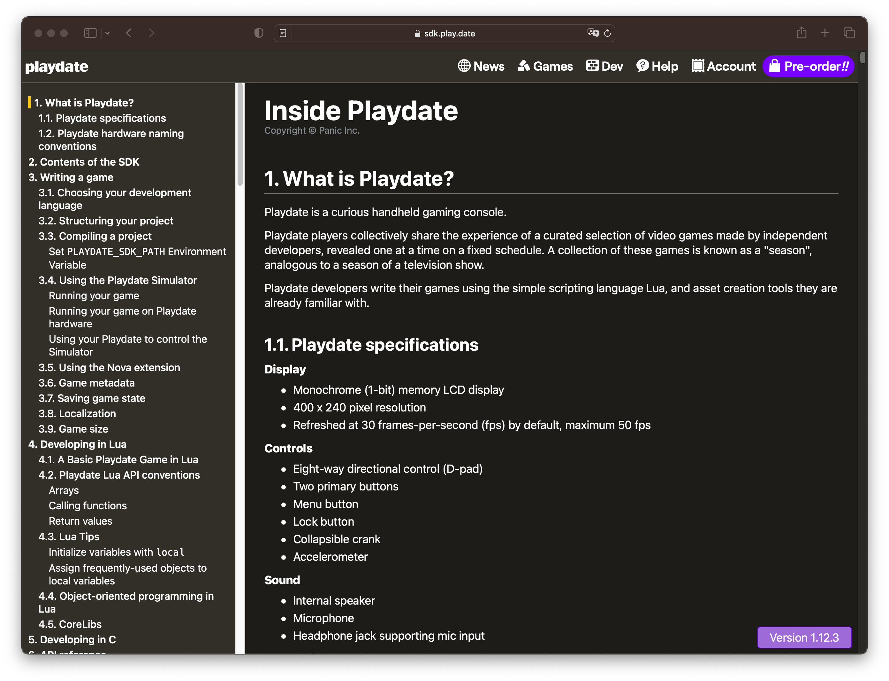

---

# Where to put your game

- Unfortunately Playdate doesn't have a store (yet) so
- You can self-host it on your website or
- Put it or sell it on websites such as [itch.io](https://itch.io/)

# 

_PS: Panic is offering funding for games, check the [Game Pitch Form](https://panic-inc.typeform.com/playdate-pitch?typeform-source=play.date) for more info_

---

# 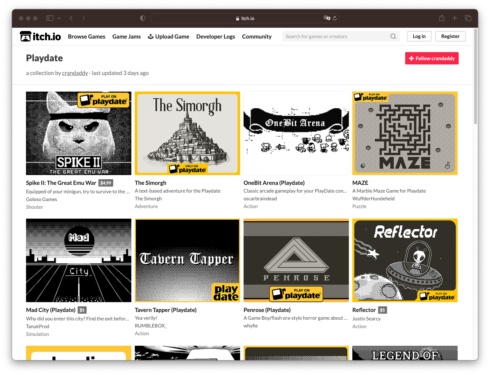

---

# Where to look for help

- [Playdate Developer Forum](https://devforum.play.date/)
- [Playdate Squad](https://discord.com/invite/zFKagQ2) aka the most active Discord server
- [/r/PlaydateConsole](https://www.reddit.com/r/PlaydateConsole/) and [/r/PlaydateDeveloper](https://www.reddit.com/r/PlaydateDeveloper/)

#### And if you want to learn more

- [SquidGodDev](https://www.youtube.com/c/SquidGodDev) for excellent video tutorials
- [Awesome Playdate](https://github.com/sayhiben/awesome-playdate) crowd-sourced awesomeness
- _/PlaydateSDK/Example_ folder

---

# Demo

[Source code](https://github.com/Pomettini/PlaydateGame003)

---

# Things I didn't cover (yet)

- Collisions
- Audio
- Accelerometer
- Fonts
- Debugging
- Deploying on a real device _(maybe for part 2?)_

But you can find all your answers on [Inside Playdate](https://sdk.play.date/)

---

# Thank you!

Slides available at _https://github.com/Pomettini/Slides_

**Questions?**
