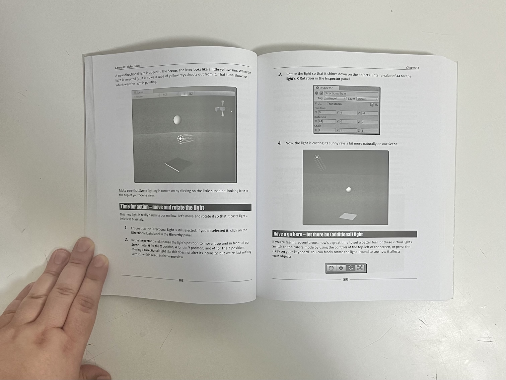
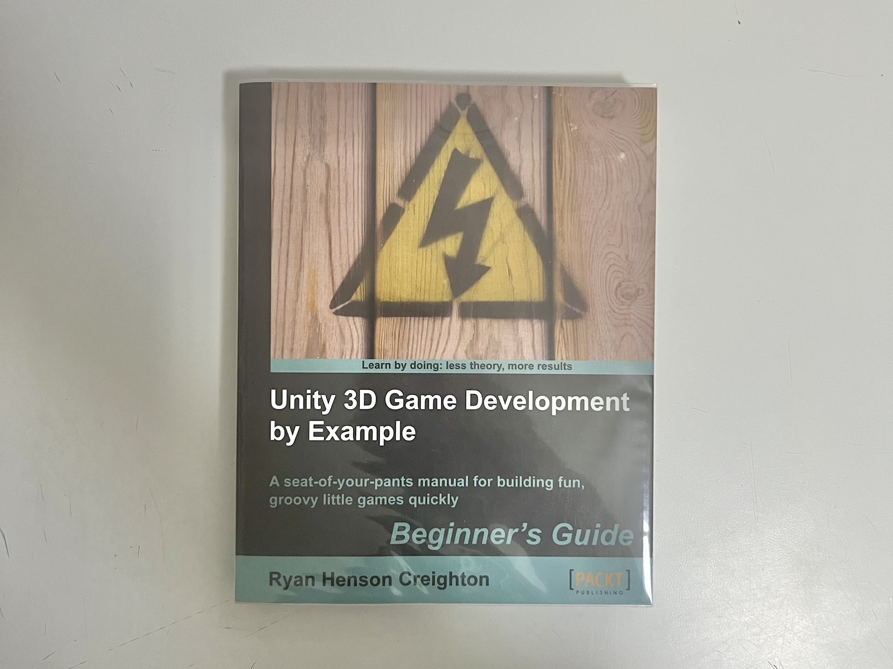
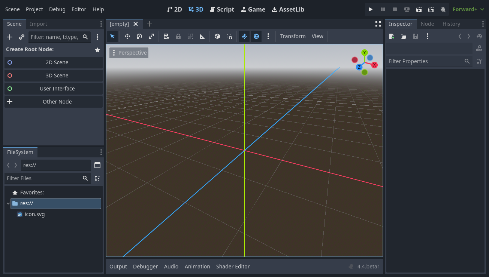
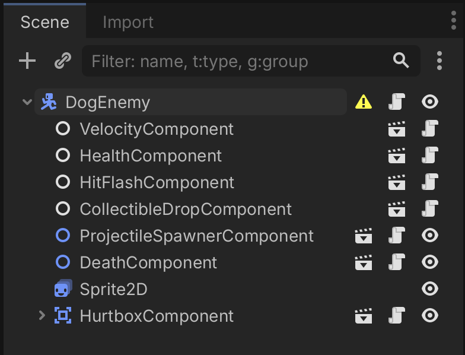
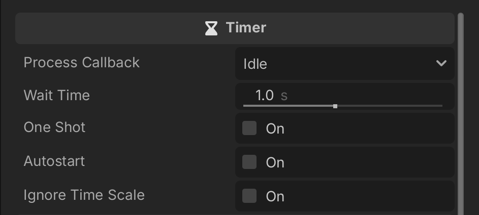
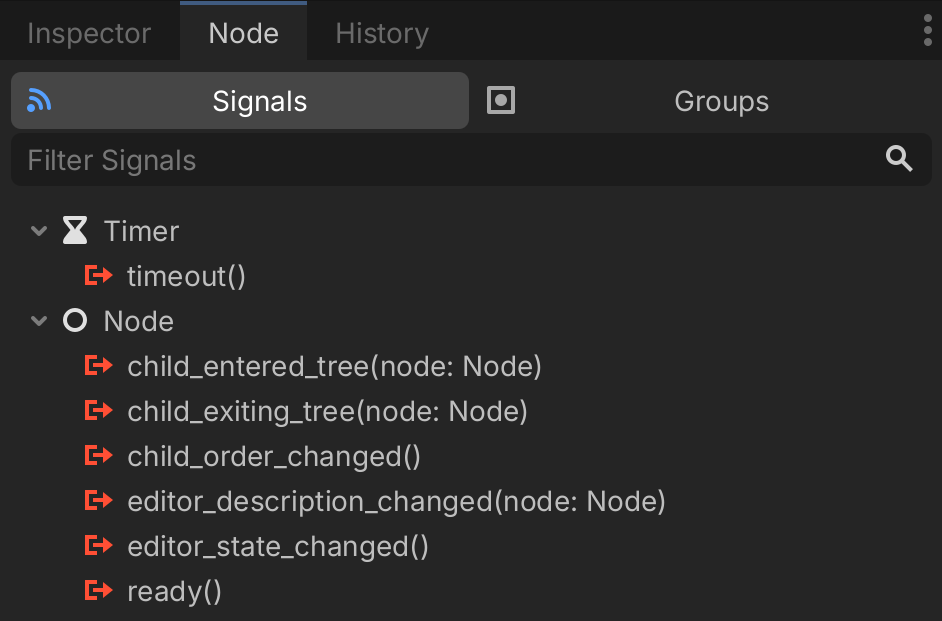
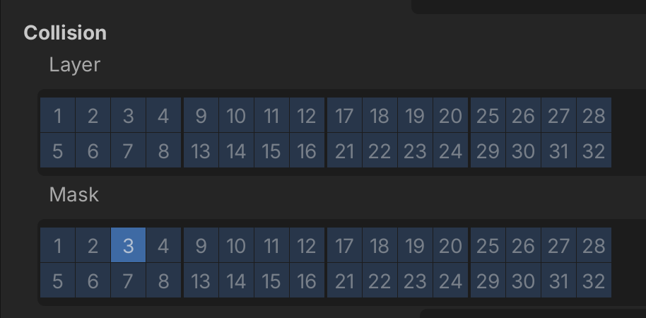
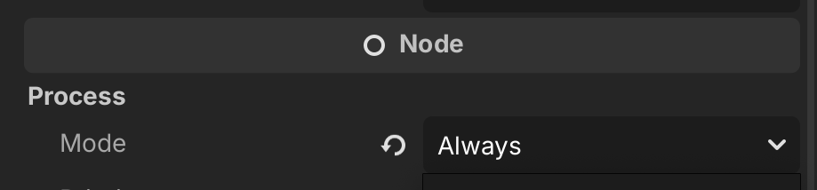
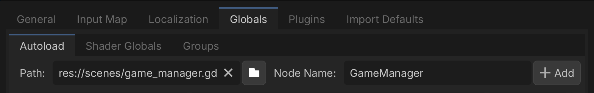

# Back to Unity island (si va a Godotpoli)

Giorgio Pomettini ([@pomettini](https://github.com/pomettini))

---

<center>

### Growing up, I want to <strike>be a pirate</strike> make videogames!

</center>

---

## Me in 2010

<center>



</center>

_(Had to buy this book in the UK because **Amazon Italy** didn't exist back then)_

---

## Me in 2010

_It was going great, until I read the word **Quaternions**..._

<center>



</center>

---

## Hi I'm Pomettini and I make weird games for fun and for profit

<center>


</center>

---

<center>

## So you want to learn Godot?

Well, you gotta start somewhere...

</center>

---



---

## Yeah it seems familiar but...

- I want to create a **scene**, where are **scenes**?
- **Nodes**? Oh, are those **GameObjects**?
- Wtf why there are so many **nodes**?
- One **script** per **node**? How am I supposed to make a **Player** with only **one script**?
- Why does **collisions** feels so counterintuitive?
- My beloved **ScriptbleObjects**, I miss them so much
  ...
- Thing in **Unity** were so simple, why should I switch?

---

## Look...

- I understand your frustration. I've been there, I swear...
- In order to learn **Godot**, you must understand that <ins>**Godot is not open-source Unity**</ins>
- **Unity is Unity** and **Godot is Godot**
- But I see you're a busy person, and I don't want to waste your time
- Here we go...

---

## I want to create a scene, where are scenes?

- In **Godot** there are **scenes**, but they work differently from **Unity**
- **Godot scenes** are just a **tree of nodes**

_So they are like... **prefabs**?_

- Yes

_Surprised Pikachu face_

- Let me put it like this: **scenes** in **Godot** are like **Unity scenes**, but they can also be be **instaced like prefabs**

---

## Nodes? Oh, are those GameObjects?

- Yes _BUT_
- In Unity, **a prefab is a container for Components** _(Transform, SpriteRender, ecc)_
- In Godot, a **node is like a GameObject with one built-in role** _(Sprite2D, Camera2D, Line2D, ecc)_

---

## Wtf why there are so many nodes?

- You will get used to it, trust me
- Take a look at the complete list of nodes: each one does one and only one thing
  - **Node2D** is the base class for **everything that has a 2D position** in the world
  - **AnimatedSprite2D** is responsible for... well... **animating a sprite**
  - **Line2D** is responsible for **drawing a line** in the 2D view
  - And so on...
- Don't you see the one you're looking for? **Make your own!**
- Also, you can attach **one (ONE!) script** to each node to add behaviour

---

## Ok but how am I supposed to make a Player with only one script?

You should start to see it by now...



Every node should be a children of the base node

---

## I have made a Player script, now how do I move it?

```ruby
extends CharacterBody2D

@export var speed := 10.0

var _direction := Vector2.RIGHT


func _ready() -> void:
    pass


func _process(delta: float) -> void:
    velocity = _direction * speed * delta
```

---

## My player is not moving, why?

- Let's check the [**CharacterBody2D** documentation](https://docs.godotengine.org/en/stable/classes/class_characterbody2d.html)...

_**CharacterBody2D** is a specialized class for physics bodies that are meant to be user-controlled. [...] They are mainly used to provide high-level API to move objects with wall and slope detection (`move_and_slide()` method)_

```ruby
func _process(delta: float) -> void:
    velocity = _direction * speed * delta
    # Added move and slide here
    move_and_slide()
```

- Trust me, <ins>**always check the documentation first**</ins>, it's so well done

---

## Cool! Now I want to shoot, how do I instantiate a projectile?

- Closer to what you would do in **Unity**, actually
- First, go to **Project Settings** > **Input Map** and **add a new action** called `shoot`
- Create a **Character2D node** and call it **Projectile**
- Make sure to assign your **projectile node** to `player_projectile` in the **inspector**

```ruby
@export var player_projectile: PackedScene

func _process(delta: float) -> void:
    if Input.is_action_just_pressed("shoot"):
        var projectile = player_projectile.instantiate()
        projectile.global_position = self.global_position
        get_tree().root.add_child(projectile)
```

---

## My bullet should explode after 1s but... wait, where are Coroutines?

- Introducing the **timer** node!



- You can put the **timer** on **autostart**, or **start** it by calling the `start()` method
- When the **timer** reaches the end, it will emit the **timeout signal**

---

## Signal? Is it like... an Event?

- Yes! And you can **assign them directly in the editor**!



- Just **double click on the signal** you want to assign and it will create a function for you!

---

## That is nice, but I want to bind them by code

- No problem, here's how to do it:

```ruby
func _ready() -> void:
    $Timer.timeout.connect(_on_timer_timeout)


func _on_timer_timeout():
    queue_free()
```

- The dollar sign on **Timer** is used to **quickly access nodes in the scene tree by their path** (in that case, just its name)
- The `queue_free` function schedules a node to be **removed from the scene safely at the end of the current frame** (basically, the equivalent to `Destroy()` in **Unity**)

---

## You didn't answered me btw, where are Coroutines?

- You can make every **GDScript** function **asynchronous** just by adding `await` inside the function

```ruby
@export var destroy_after := 1.0


func _ready() -> void:
    await get_tree().create_timer(destroy_after, true).timeout
    queue_free()
```

- This snippet **creates a timer** that, when the **timeout is reached**, **destroys** the object that is attached to
- Pretty cool isn't it?

---

## I want my projectile to hit stuff, how does collisions work?

- Like in **Unity**, **collision** happens when **two physics objects overlap** _(duh!)_
- In **Godot** we have different **nodes**, each one for a different use case:
  - **StaticBody2D** (objects that doesn't move: _walls, floors, etc_)
  - **RigidBody2D** (objects that are affected by physics indirectly: _boxes, ecc_)
  - **CharacterBody2D** (objects moved by the player or AI)
  - **Area2D** (objects that detects the presence of other objects but are not solid)
- You should also add a **CollisionShape2D** as a child of the physics body and, from the **inspector**, **add a new shape** _(RectangleShape2D, CircleShape2D, etc)_
- Continues in the next slide...

---

## I want my projectile to hit stuff, how does collisions work?



- Collision **layers** detect what can **detect ME**
- Collision **marks** detect what **I can detect**
- Please [watch this 43s video](https://www.youtube.com/watch?v=9k8cMzv0ZNo), he explains it way better than me

---

## Now my game needs to be paused... but I see no Time.timeScale

- You know that **Godot** has its internal pause state?

```ruby
get_tree().paused = true;
```

- Doing so will **pause** the **entire scene tree**, so all the update callbacks such as `_process()` and `_physics_process()` won't be called
- If your want a specific node to keep working even while the game is paused, just set its **Process Mode** to **Always**



---

## I think I need a GameManager, does Godot support singletons?

- **Godot** has its unique way to handle **singletons** and are called **autoloads**
- An **autoload** is a **script** or **scene** that is **automatically loaded** and **always available**
- Go to **Project Settings** > **Autoload** tab > Select your script/scene and give it a name

  

- Now you can access it like this:

```ruby
GameManager.score += 10;
GameManager.reset_score();
```

---

## ScreenManager, where is it? I need to change a scene, oh wait...

- Though scenes work differently in **Godot**, there is a method that closely resembles what you would expect from `ScreenManager.LoadScene`

```
get_tree().change_scene_to_file("res://scenes/MainMenu.tscn")
```

- This **unloads the current scene and loads a new one**, just like **Unity's** `LoadScene`
- Heavy scene? Loading is chugging the game? No problem

```ruby
const MAIN_MENU_SCENE := preload("res://scenes/MainMenu.tscn")

get_tree().change_scene_to_packed(MAIN_MENU_SCENE)
```

- **Preload** can also be used for **every resource in the game**!

---

## My beloved ScriptableObjects, I miss them...

- I feel that too...
- Luckily, Godot has its data container too: **resources**
- Want to create your **custom resource**? Create a **script** and let it **inherit from resource**

```ruby
class_name IntVariable
extends Resource

var value: int
```

- Then you can create your custom made resource by right-clicking on the **FileSystem** dock and **Create New** > **Resource** > **YourCustomResource**

---

## I want to save Player's best score... does Godot have PlayerPrefs?

- Short answer: **no**
- But what if I tell you that you can use **resources** to save data?
- Let's make a **PlayerData** custom **resource**:

```ruby
class_name PlayerData
extends Resource

@export var player_name: String
@export var score: int
```

Continues in the next slide...

---

### Saving data example:

```ruby
func save_player_data():
    var data = PlayerData.new()
    data.player_name = "Pomettini"
    data.score = 151

    var save_path = "user://player_data.res"
    var error = ResourceSaver.save(save_path, data)

    if error != OK:
        print("Failed to save player data.")
    else:
        print("Player data saved.")
```

- Data will be saved at `OS.get_user_data_dir()` in **binary** format
- You can use **ResourceSaver** to save pretty much anything, <ins>**even scenes!**</ins>

---

### Loading data example:

```ruby
func load_player_data():
    var save_path = "user://player_data.res"

    if not FileAccess.file_exists(save_path):
        print("No save file found.")
        return

    var loaded = ResourceLoader.load(save_path) as PlayerData

    if loaded == null:
        print("Failed to load player data.")
        return
```

- **ResourceLoad** is a **safe** and sandboxed approach to **load resources**: avoids remote code execution and it's resistant to tampering (but you still **need to check types!**)

---

## Okay but my jam ends in 1h and I need a faster approach...

```ruby
func save_data():
    var config = ConfigFile.new()
    config.set_value("player", "name", "Pomettini")
    config.set_value("player", "score", 151)
    config.save("user://save.cfg")

func load_data():
    var config = ConfigFile.new()
    var err = config.load("user://save.cfg")
    if err == OK:
        var name = config.get_value("player", "name", "DefaultName")
        var score = config.get_value("player", "score", 0)
```

- This works exactly like **Unity's PlayerPrefs** and works well for prototypes

---

## Btw coming from Unity the interface looks so caothic...

- I get that, here's some tweaks you can do:
- Create an [editor profile](https://docs.godotengine.org/en/latest/tutorials/editor/managing_editor_features.html) (you can **hide stuff** you won't use, like XR stuff)
  - You can even **hide all the 3D stuff** if you're making a **2D game**
- From **Editor Settings** > **General** > **Inspector** > **Disable Folding** (check this to avoid sections to be collapsed in the inspector, you can find properties easily this way)
- Install [PassiveStar's Godot Theme](https://github.com/passivestar/godot-minimal-theme) (trust me, it looks way better)
- Bonus tip: **Project Settings** > **Debug** > **GDScript** > Set **Untyped Declaration** to **Warn** (saves you lots of headaches by enforcing static typing)

---

### Things I also wanted to talk about <strike>but I was playing Mario Kart World help</strike>

- **Godot's** internal [**tweening system**](https://docs.godotengine.org/en/stable/classes/class_tween.html) (seriously look at this)
- **Godot's** internal [**localization system**](https://docs.godotengine.org/en/stable/tutorials/i18n/internationalizing_games.html)
- How to write **shaders** ([Godot Shaders](https://godotshaders.com/) is a great website with cool **examples**)
- How does [**UI**](https://docs.godotengine.org/en/stable/tutorials/ui/index.html) work in **Godot** (I might write an entire talk about that...)
- How to use [**VSCode**](https://code.visualstudio.com/) in **Godot** instead of its internal editor
- How to use **C#** or [other languages](https://docs.godotengine.org/en/stable/getting_started/step_by_step/scripting_languages.html) with **Godot**
- [**Exporting the project**](https://docs.godotengine.org/en/latest/tutorials/export/exporting_projects.html) on **PC** or [**WASM**](https://webassembly.org/) for the **web**

---

## I want to learn more, where should I look?

- Paid resources:
  - [**GDQuest's** courses](https://www.gdquest.com/) (recommended)
  - [Create a 2D Survivors Style Game in **Godot**](https://www.udemy.com/course/create-a-complete-2d-arena-survival-roguelike-game-in-godot-4/) from [**Firebelley**](https://www.youtube.com/@FirebelleyGames) (very recommended)
- Free resources:
  - [**GDQuest's** YouTube channel](https://www.youtube.com/@Gdquest)
  - [Bacon and Games](https://www.youtube.com/@baconandgames)
  - [**Godot** Engine Official YouTube channel](https://www.youtube.com/@GodotEngineOfficial)
  - [Official **Godot** Docs](https://docs.godotengine.org/en/stable/) (read it like if it was the bible)

---

# Thank you!

**Slides:** https://github.com/pomettini/slides/

Special thanks to **[Nohu Games](https://nohu-games.itch.io/)** 🫶 _(sorry that I lied, I didn't know Godot back then)_
